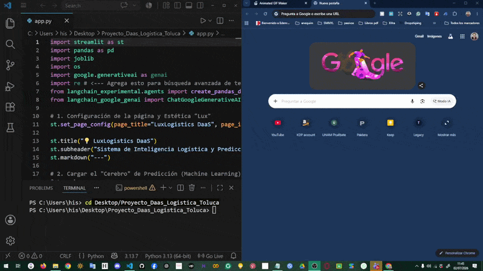

# 💡 LuxLogistics DaaS: Smart Risk Monitor & Agentic AI
**Inteligencia Predictiva y Conversacional para el Corredor Toluca-Lerma**

## 🚀 [PRUEBA LA APP EN VIVO AQUÍ](https://luxlogisticsdaas1.streamlit.app)

### 📋 Resumen del Proyecto
LuxLogistics DaaS es una plataforma de **Data-as-a-Service** de nueva generación. No solo identifica riesgos de retraso mediante Machine Learning, sino que democratiza el acceso a la información a través de una capa de **IA Agéntica**. El sistema permite a los tomadores de decisiones "hablar" con sus datos para descubrir insights operativos en tiempo real.

---

## 🚀 Características Principales

### 1. 🔮 Simulador de Riesgo Predictivo (ML)
Un motor basado en **Ciencia de Datos Honesta**, libre de sesgos y *Data Leakage*.
*   **Modelo:** RandomForestClassifier optimizado para la realidad industrial del Valle de Toluca.
*   **Dataset:** Procesamiento de 180,000+ registros logísticos.
*   **Métrica Clave:** F1-Score de 0.74, priorizando la detección de carga crítica de alto valor.

### 2. 🤖 LuxLogistics Smart Chat (Agentic AI) - ¡NUEVO!
Diferenciándose de los chatbots convencionales, esta capa utiliza un **Agente Autónomo** para el análisis de datos.
*   **Engine:** Google Gemini (Flash/Pro) orquestado vía **LangChain**.
*   **Pattern:** Implementación del patrón **ReAct** (Reason + Act), permitiendo que la IA escriba y ejecute código Python dinámicamente sobre el dataset de 91MB.
*   **Resiliencia:** Arquitectura de recuperación de errores personalizada para limpiar metadatos técnicos de los parsers de LLM, entregando respuestas de negocio puras y profesionales.

---

## 🧠 Arquitectura de la IA (Capa Agéntica)
El Agente de LuxLogistics sigue un flujo de pensamiento lógico para garantizar la precisión:
1.  **Interpretación:** Traduce preguntas de negocio (ej. "¿Cuáles son las 3 regiones con mayor venta?") a objetivos técnicos.
2.  **Generación:** Escribe el script de Pandas necesario para interrogar al DataFrame.
3.  **Ejecución:** Corre el código en un entorno controlado.
4.  **Sanitización:** Filtra y formatea la salida para eliminar ruido técnico y links de depuración.

---

## 🛠️ Stack Tecnológico
*   **Lenguaje:** Python 3.12
*   **Data Science:** Pandas, Scikit-Learn, NumPy, Joblib.
*   **Generative AI:** LangChain, Google Generative AI (Gemini).
*   **Interfaz:** Streamlit (Layout Wide).
*   **Infraestructura:** Git LFS & GitHub (Manejo de datasets de gran escala).

---

## 📊 Visualización de la IA en Acción 
Click para visualizar el GIF:

---

## 📂 Estructura del Repositorio
*   `app.py`: Interfaz dual (Simulador + Smart Chat).
*   `data_logistica_limpia.csv`: Dataset optimizado de 91MB.
*   `modelo_luxlogistics.joblib`: Cerebro predictivo comprimido.
*   `requirements.txt`: Lista de dependencias de grado industrial.

---

## 👩‍💻 Sobre la Autora
**LCDE. Talia González López**
*Applied AI Engineer & Data Scientist*
Egresada del Tec de Monterrey (ITESM). Especialista en transformar incertidumbre operativa en certidumbre inteligente.

[LinkedIn](https://www.linkedin.com/in/talia-gonzalezl/) | [Portfolio](https://luxlogisticsdaas1.streamlit.app)